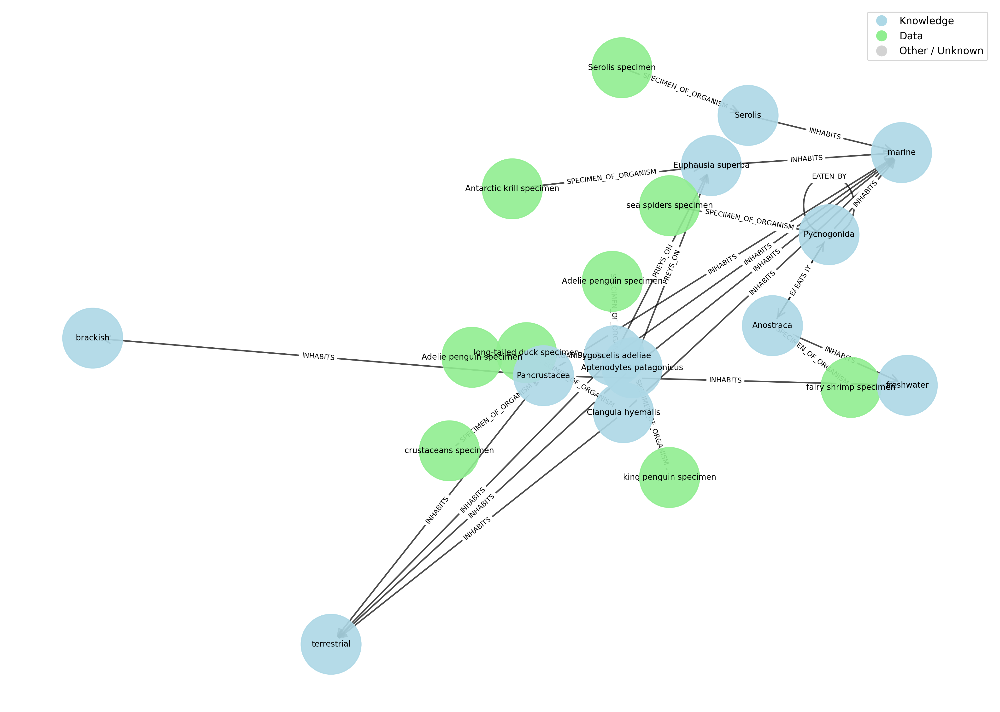

# KG Public Demo

Minimal public reproducibility demo for the onboarding and enrichment workflow used in the
Polar Science Knowledge-Graph project.

This repository demonstrates a small end-to-end example of how source records are:

1. registered as data-layer nodes
2. anchored to organism nodes through `SPECIMEN_OF_ORGANISM`
3. enriched with organism interaction relations from GloBI
4. enriched with habitat relations from WoRMS
5. loaded into Neo4j for inspection and summary statistics

The default run uses bundled cached responses, so the demo is stable and reproducible.

## Features

- Small specimen input dataset in `data/input/test_data.csv`
- Python pipeline for onboarding and enrichment
- Neo4j database running only inside Docker
- Terminal-based graph inspection with `cypher-shell`
- Generated intermediate CSV artifacts for each workflow stage

## Requirements

- Docker
- Docker Compose

## Quick Start

Run the full demo:

```bash
./scripts/run_demo.sh
```

This script:

- starts Neo4j inside Docker
- builds the demo application image
- runs the onboarding pipeline
- imports the graph into Neo4j
- prints final graph statistics in the terminal

After the run completes, Neo4j remains available inside Docker for terminal-based queries.

Open an interactive Cypher shell:

```bash
./scripts/query_neo4j.sh
```

Stop the demo containers when you are done:

```bash
./scripts/stop_demo.sh
```

## Graph Preview

The graph produced by this demo is a small specimen-centered knowledge graph linking
specimen records, organism nodes, habitat nodes, and organism-to-organism relations.
Its overall structure is roughly like the following preview:



The exact layout in the image is illustrative, but it reflects the same kinds of nodes and
relations created by the demo workflow.

## Shell Scripts

### `./scripts/run_demo.sh`

Purpose:
Run the complete demo workflow from start to finish.

Usage:

```bash
./scripts/run_demo.sh
```

### `./scripts/query_neo4j.sh`

Purpose:
Open `cypher-shell` inside the Neo4j container, or run a one-line Cypher query from the terminal.

Usage:

```bash
./scripts/query_neo4j.sh
```

Run a single query directly:

```bash
./scripts/query_neo4j.sh "MATCH (n) RETURN labels(n), count(n);"
```

### `./scripts/stop_demo.sh`

Purpose:
Stop and remove the Docker Compose services created for the demo.

Usage:

```bash
./scripts/stop_demo.sh
```

## Example Cypher Queries

Count node labels:

```cypher
MATCH (n)
UNWIND labels(n) AS label
RETURN label, count(*) AS count
ORDER BY count DESC;
```

Count relationship types:

```cypher
MATCH ()-[r]->()
RETURN type(r) AS relation_type, count(*) AS count
ORDER BY count DESC;
```

Inspect a few example edges:

```cypher
MATCH (a)-[r]->(b)
RETURN a.id, type(r), b.id
LIMIT 20;
```

## Output Files

Each run writes the following files to `outputs/current/`:

- `source_records.csv`
- `organism.csv`
- `anchor.csv`
- `habitat.csv`
- `globi.csv`
- `inhabit.csv`

These files expose each stage of the workflow in a directly inspectable form.

## Optional Configuration

The default setup works without any additional configuration.

If you want to change the Neo4j password, create a local environment file:

```bash
cp .env.example .env
```

Then edit:

```env
NEO4J_PASSWORD=your-password
```

## Common Commands

Run the pipeline without importing into Neo4j:

```bash
docker compose run --rm app python main.py --mode frozen --skip-neo4j
```

Run the pipeline and reset the Neo4j database first:

```bash
docker compose run --rm app python main.py --mode frozen --reset-db
```

Refresh the bundled cache from live external APIs:

```bash
docker compose run --rm app python main.py --mode live --refresh-cache --skip-neo4j
```

Start only Neo4j:

```bash
docker compose up -d neo4j
```

## Repository Structure

```text
data/
  input/      demo input records
  cache/      bundled cached API responses
outputs/
  current/    generated CSV artifacts
src/kg_public_demo/
  pipeline.py
  ncbi.py
  globi.py
  worms.py
  neo4j_loader.py
main.py
kg_graph.png
docker-compose.yml
scripts/
  run_demo.sh
  query_neo4j.sh
  stop_demo.sh
```
